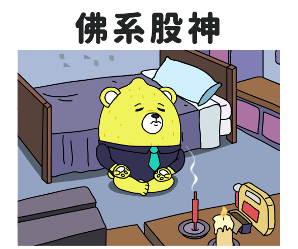

# Lemon Swap

```
A Defi project, makes low risk (MEV protect), zero transaction fees, earning additional income while saving on Gas fees.
```



## How it's works?

Through Uniswap, provide an out-of-range single-sided LP position [akin to limit orders on centralized exchanges (CEX)].
Once all the base assets you provided for the LP are transferred to the opposing side, LemonSwap smart contract collaborating with a harvesting bot or any EOA address near your position to automatic close position for you.


## Demo UI

